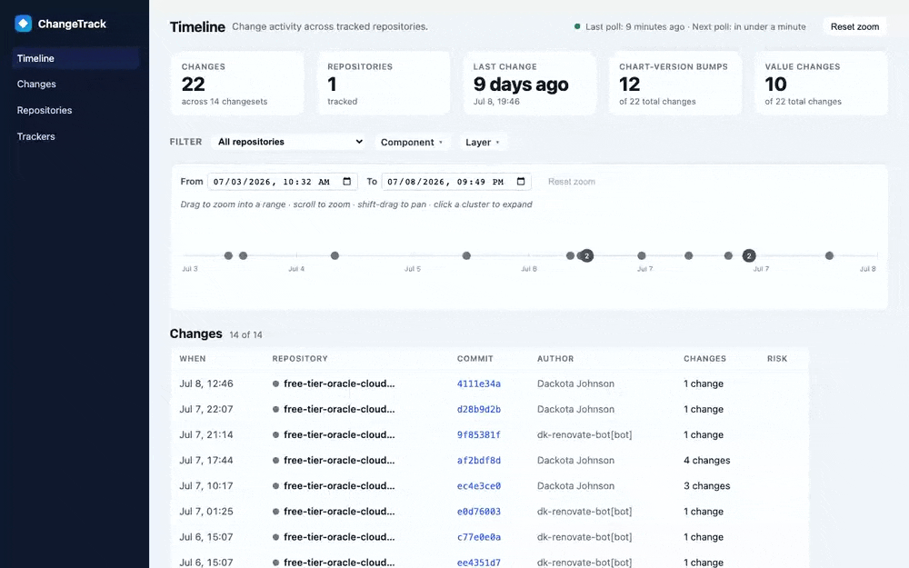

# Change Tracking Dashboard

Watch what actually changes across your GitOps repos. The dashboard polls the git
history of your config repositories, extracts the fields you care about — Helm
chart/subchart versions, image tags, Terraform inputs — and surfaces every change
as a faceted, time-ordered feed. Click any change to see the real impact: the
rendered Helm manifest diff or the Terraform resource-change view for that commit.



**Live demo:** <https://changes.dackota.com>

## Why

A version bump in a `Chart.yaml` or `values.yaml` is one line in a diff, but it can
change hundreds of lines of rendered Kubernetes manifests. This tool answers three
questions that a plain `git log` can't:

- **What changed, and when?** A timeline of every tracked field change, grouped by
  commit, across all your repos.
- **What was the real blast radius?** Chart-version bumps are rendered to their
  full manifest diff; Terraform changes are shown as a static, credential-free
  resource-change view — no cluster or cloud access required.
- **Is anything risky?** Changes are classified and flagged (replace/destroy,
  security-sensitive, cost tripwires) right in the feed.

## Features

- **Timeline + feed** — every change in commit order, with an interactive timeline
  chart (drag to zoom, scroll, click a cluster to expand) and headline KPIs.
- **Faceted filtering** — filter the feed by repository or by facets you define
  (e.g. `component`, `layer`) with include/exclude toggles.
- **Rendered Helm chart diffs** — a chart/subchart version bump expands to the
  actual rendered-manifest delta between the old and new version.
- **Terraform plan diffs** — a static, credential-free resource-change view for
  HCL changes, classified by kind and risk.
- **Risk badges** — replace/destroy, security, and cost-tripwire signals surfaced
  on the feed.
- **Issue/PR links** — changesets link back to the issues referenced in their
  commit messages.
- **Repositories & Trackers views** — per-repo rollups and a live view of your
  tracker configuration and poll health.
- **Private repos** — optional GitHub App auth using short-lived installation
  tokens.
- **Operable** — OpenTelemetry traces/metrics/logs, a `/healthz` liveness probe,
  hot-reloaded config, and a single static binary in a distroless image.

## How it works

```
config.yaml ─▶ poller ─▶ field extractor (jq / HCL) ─▶ change detector ─▶ SQLite ─▶ web UI
   (trackers)   (git)      (per file glob + field)       (diff by key)    (store)   (timeline)
```

For each tracker the poller walks the repo's git history on a cadence, extracts the
configured fields from files matching each glob at every commit, and records a
**Change** whenever a tracked value differs from the previous commit. All changes
from a single commit form a **Changeset**. Chart and Terraform diffs are rendered
on demand when you open a changeset.

## Quick start

The dashboard is a single binary configured by a YAML file plus a few environment
variables.

### Run with Docker

```bash
docker run --rm -p 8080:8080 \
  -v "$PWD/config.yaml:/etc/dashboard/config.yaml:ro" \
  -v "ctd-data:/data" \
  -e DB_PATH=/data/changes.db \
  ghcr.io/dackota/change-tracking-dashboard:latest
```

Then open <http://localhost:8080>.

### Run from source

Requires Go 1.26+.

```bash
CONFIG_PATH=./config.yaml DB_PATH=./changes.db \
  go run ./cmd/dashboard
```

## Configuration

### Environment variables

| Variable                       | Default                       | Purpose                                                        |
| ------------------------------ | ----------------------------- | ------------------------------------------------------------- |
| `CONFIG_PATH`                  | `/etc/dashboard/config.yaml`  | Path to the tracker config file (watched and hot-reloaded).   |
| `DB_PATH`                      | `changes.db`                  | Path to the SQLite database file (created if missing).        |
| `LISTEN_ADDR`                  | `:8080`                       | HTTP listen address.                                          |
| `OTEL_EXPORTER_OTLP_ENDPOINT`  | *(unset)*                     | OTLP endpoint for traces/metrics; overrides the config value. |
| `GITHUB_APP_ID`                | *(unset)*                     | Enables GitHub App auth for private repos (see below).         |
| `GITHUB_APP_INSTALLATION_ID`   | *(unset)*                     | GitHub App installation ID.                                    |
| `GITHUB_APP_PRIVATE_KEY_FILE`  | *(unset)*                     | Path to the GitHub App private key (PEM).                      |

### Tracker config file

The config file defines global defaults, optional telemetry, and one or more
**trackers**. Each tracker points at a repo, extracts fields from files matching
globs, and (optionally) derives facets from file paths. The file is watched:
edits take effect on the next poll cycle without a restart.

```yaml
# Global defaults; any tracker may override these.
defaults:
  pollIntervalSeconds: 600      # poll each repo every 10 minutes
  backfillDays: 90              # walk 90 days of history on first run

# Optional. Empty (or omitted) disables telemetry export safely.
# OTEL_EXPORTER_OTLP_ENDPOINT overrides this when set.
observability:
  otlp_endpoint: ""             # e.g. "otel-collector:4317"

trackers:
  - repo: https://github.com/your-org/your-gitops.git
    # Named capture groups become facets in the UI. A path like
    # gitops/platform/argocd/... yields layer=platform, component=argocd.
    facetRegex: '^gitops/(?P<layer>[^/]+)/(?P<component>[^/]+)/'
    files:
      # Track Helm chart/subchart versions declared in Chart.yaml.
      - glob: 'gitops/*/*/Chart.yaml'
        fields:
          - name: chartDependencies
            expr: '.dependencies | map({(.name): .version}) | add'
      # Track image tags declared in values.yaml.
      - glob: 'gitops/*/*/values.yaml'
        fields:
          - name: imageTags
            expr: 'to_entries | map(select(.value.image.tag)) | map({(.key): .value.image.tag}) | add'
```

Field reference:

- `defaults.pollIntervalSeconds` / `defaults.backfillDays` — global cadence and
  first-run history window; a tracker may override either.
- `trackers[].repo` — a local path or an `https://` URL. `http://` is rejected.
- `trackers[].facetRegex` — a regex applied to matched file paths; each named
  capture group becomes a filterable facet in the UI. Leave empty for no facets.
- `trackers[].files[].glob` — file glob, relative to the repo root.
- `trackers[].files[].fields[].name` — the human-readable field label shown on
  changes.
- `trackers[].files[].fields[].expr` — a [jq](https://jqlang.github.io/jq/)
  expression (evaluated by [gojq](https://github.com/itchyny/gojq)) that extracts
  the tracked value from the parsed file.
- `trackers[].engine` — extractor backend: `jq`, `hcl` (for Terraform/HCL files),
  or omit to auto-detect from the file glob.

## HTTP endpoints

| Path                    | Description                                      |
| ----------------------- | ------------------------------------------------ |
| `/`                     | Timeline (KPIs, timeline chart, change feed).    |
| `/changes`              | The change feed on its own.                      |
| `/repositories`         | Per-repository rollups.                          |
| `/trackers`             | Configured trackers and per-tracker poll health. |
| `/healthz`              | Liveness check (no dependencies).                |
| `/api/changesets*`      | JSON + HTML fragments backing the UI.            |

## Private repositories (GitHub App)

To track private repos, set `GITHUB_APP_ID`, `GITHUB_APP_INSTALLATION_ID`, and
`GITHUB_APP_PRIVATE_KEY_FILE`. When all three are present, the dashboard mints
short-lived installation tokens and clones/fetches `https://` repos with them.
Credentials are never attached to non-HTTPS remotes. Local-path repos need no
auth. Clones are ephemeral (under the system temp dir); a restart re-clones and
resumes incrementally from the stored high-water mark with no data loss.

## Development

```bash
go build ./...          # build
go test -race ./...     # test (race detector on)
go vet ./...            # static analysis
```

The web UI is server-rendered Go HTML with a single vanilla-JS file
(`internal/web/static/timeline.js`); there is no frontend build step. Storage is
pure-Go SQLite (`modernc.org/sqlite`), so the binary is static and CGO-free.
</content>
