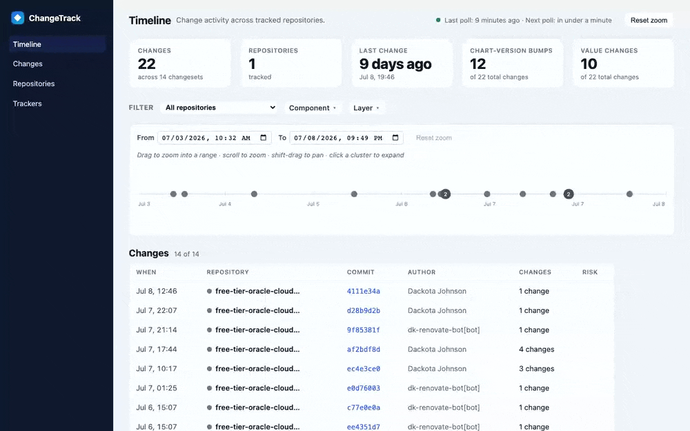

# Change Tracking Dashboard

Watch what actually changes across your GitOps repos. The dashboard polls the git
history of your config repositories, extracts the fields you care about — Helm
chart/subchart versions, image tags, Terraform inputs — and surfaces every change
as a faceted, time-ordered feed. Click any change to see the real impact: the
rendered Helm manifest diff or the Terraform resource-change view for that commit.



**Live demo:** <https://changes.dackota.com>

## Why

A version bump in a `Chart.yaml` or `values.yaml` is one line in a diff, but it can
change hundreds of lines of rendered Kubernetes manifests. This tool answers three
questions that a plain `git log` can't:

- **What changed, and when?** A timeline of every tracked field change, grouped by
  commit, across all your repos.
- **What was the real blast radius?** Chart-version bumps are rendered to their
  full manifest diff; Terraform changes are shown as a static, credential-free
  resource-change view — no cluster or cloud access required.
- **Is anything risky?** Changes are classified and flagged (replace/destroy,
  security-sensitive, cost tripwires) right in the feed.

## Features

- **Timeline + feed** — every change in commit order, with an interactive timeline
  chart (drag to zoom, scroll, click a cluster to expand) and headline KPIs.
- **Faceted filtering** — filter the feed by repository or by facets you define
  (e.g. `component`, `layer`) with include/exclude toggles.
- **Rendered Helm chart diffs** — a chart/subchart version bump expands to the
  actual rendered-manifest delta between the old and new version.
- **Terraform plan diffs** — a static, credential-free resource-change view for
  HCL changes, classified by kind and risk.
- **Impact tiers** — every changeset carries an always-present `major` /
  `minor` / `patch` / `downgrade` / `other` badge derived from the semantic-
  version delta of its changes — no configuration, no migration (see
  [Impact tiers](#impact-tiers)).
- **Risk badges** — replace/destroy, security, and cost-tripwire signals
  surfaced on the feed, orthogonal to Impact. The rule set is configurable
  (see [Risk rules](#risk-rules)).
- **Issue/PR links** — changesets link back to the issues referenced in their
  commit messages.
- **Repositories & Trackers views** — per-repo rollups and a live view of your
  tracker configuration and poll health.
- **Private repos** — optional GitHub App auth using short-lived installation
  tokens.
- **Operable** — OpenTelemetry traces/metrics/logs, a `/healthz` liveness probe,
  hot-reloaded config, and a single static binary in a distroless image.

## How it works

```
config.yaml ─▶ poller ─▶ field extractor (jq / HCL) ─▶ change detector ─▶ SQLite ─▶ web UI
   (trackers)   (git)      (per file glob + field)       (diff by key)    (store)   (timeline)
```

For each tracker the poller walks the repo's git history on a cadence, extracts the
configured fields from files matching each glob at every commit, and records a
**Change** whenever a tracked value differs from the previous commit. All changes
from a single commit form a **Changeset**. Chart and Terraform diffs are rendered
on demand when you open a changeset.

## Quick start

The dashboard is a single binary configured by a YAML file plus a few environment
variables.

### Run with Docker

```bash
docker run --rm -p 8080:8080 \
  -v "$PWD/config.yaml:/etc/dashboard/config.yaml:ro" \
  -v "ctd-data:/data" \
  -e DB_PATH=/data/changes.db \
  ghcr.io/dackota/change-tracking-dashboard:latest
```

Then open <http://localhost:8080>.

### Run from source

Requires Go 1.26+.

```bash
CONFIG_PATH=./config.yaml DB_PATH=./changes.db \
  go run ./cmd/dashboard
```

## Configuration

### Environment variables

| Variable                       | Default                       | Purpose                                                        |
| ------------------------------ | ----------------------------- | ------------------------------------------------------------- |
| `CONFIG_PATH`                  | `/etc/dashboard/config.yaml`  | Path to the tracker config file (watched and hot-reloaded).   |
| `DB_PATH`                      | `changes.db`                  | Path to the SQLite database file (created if missing).        |
| `LISTEN_ADDR`                  | `:8080`                       | HTTP listen address.                                          |
| `OTEL_EXPORTER_OTLP_ENDPOINT`  | *(unset)*                     | OTLP endpoint for traces/metrics; overrides the config value. |
| `GITHUB_APP_ID`                | *(unset)*                     | Enables GitHub App auth for private repos (see below).         |
| `GITHUB_APP_INSTALLATION_ID`   | *(unset)*                     | GitHub App installation ID.                                    |
| `GITHUB_APP_PRIVATE_KEY_FILE`  | *(unset)*                     | Path to the GitHub App private key (PEM).                      |

### Tracker config file

The config file defines global defaults, optional telemetry, and one or more
**trackers**. Each tracker points at a repo, extracts fields from files matching
globs, and (optionally) derives facets from file paths. The file is watched:
edits take effect on the next poll cycle without a restart.

```yaml
# Global defaults; any tracker may override these.
defaults:
  pollIntervalSeconds: 600      # poll each repo every 10 minutes
  backfillDays: 90              # walk 90 days of history on first run

# Optional. Empty (or omitted) disables telemetry export safely.
# OTEL_EXPORTER_OTLP_ENDPOINT overrides this when set.
observability:
  otlp_endpoint: ""             # e.g. "otel-collector:4317"

trackers:
  - repo: https://github.com/your-org/your-gitops.git
    # Named capture groups become facets in the UI. A path like
    # gitops/platform/argocd/... yields layer=platform, component=argocd.
    facetRegex: '^gitops/(?P<layer>[^/]+)/(?P<component>[^/]+)/'
    files:
      # Track Helm chart/subchart versions declared in Chart.yaml.
      - glob: 'gitops/*/*/Chart.yaml'
        fields:
          - name: chartDependencies
            expr: '.dependencies | map({(.name): .version}) | add'
      # Track image tags declared in values.yaml.
      - glob: 'gitops/*/*/values.yaml'
        fields:
          - name: imageTags
            expr: 'to_entries | map(select(.value.image.tag)) | map({(.key): .value.image.tag}) | add'
```

Field reference:

- `defaults.pollIntervalSeconds` / `defaults.backfillDays` — global cadence and
  first-run history window; a tracker may override either.
- `trackers[].repo` — a local path or an `https://` URL. `http://` is rejected.
- `trackers[].facetRegex` — a regex applied to matched file paths; each named
  capture group becomes a filterable facet in the UI. Leave empty for no facets.
- `trackers[].files[].glob` — file glob, relative to the repo root.
- `trackers[].files[].fields[].name` — the human-readable field label shown on
  changes.
- `trackers[].files[].fields[].expr` — a [jq](https://jqlang.github.io/jq/)
  expression (evaluated by [gojq](https://github.com/itchyny/gojq)) that extracts
  the tracked value from the parsed file.
- `trackers[].engine` — extractor backend: `jq`, `hcl` (for Terraform/HCL files),
  or omit to auto-detect from the file glob.

### Impact tiers

Every changeset (and every individual change within it) carries an **impact**
tier, computed at read time from the semantic-version delta of the change's old
and new values — never stored, never configured, and never blank:

| Tier | Meaning | Example |
| --- | --- | --- |
| `major` | Breaking upgrade | `1.9.0 → 2.0.0` |
| `minor` | New functionality | `1.20.3 → 1.21.0` |
| `patch` | Fix-level bump | `10.1.2 → 10.1.3` |
| `downgrade` | Version moved backwards (rollback) | `2.0.0 → 1.9.0` |
| `other` | Not a comparable version change | add/remove, `~>7.0 → ~>8.0`, node count `2 → 3` |

A changeset's badge is the highest-precedence tier among its changes:

```
major > downgrade > minor > patch > other
```

A rollback is more notable than a routine forward minor/patch bump, but a
major version jump is still the headline for a changeset containing both.

Impact requires **no configuration** — it works out of the box on upgrade,
with no schema migration and no re-poll, since it's derived fresh on every
read (the same way `Kind` already is). It is **orthogonal to Risk**: a
changeset carries one impact tier *and* zero-or-more risk flags — a
cost-tripwire node-pool resize still shows its risk badge alongside whatever
impact tier the resize itself carries.

Because Impact now owns the major-version signal, the risk rule set's
previous `major version bump` default was removed (see [Risk
rules](#risk-rules) below for how to re-add it explicitly via `riskRules` if
you relied on that badge specifically).

### Risk rules

Every changeset is classified into zero or more **risk** classes at read time and
badged in the feed, alongside (not instead of) its Impact tier. Classification is
data-driven: a rule fires when *all* of its predicates match a change in the
changeset.

The dashboard ships a built-in default rule set: replace/destroy, security, and
cost-tripwire, tuned to the OCI dogfood conventions. It no longer ships a
default major-version-bump rule — `impact: major` (see [Impact
tiers](#impact-tiers) above) carries that signal now, so a major bump earns
exactly one badge instead of two saying the same thing. The `semverBump`
predicate itself is still fully supported for a config-authored rule (see
below) — only the shipped default was removed. Bare integers (a node count `2`
→ `3`) are treated as quantities, not versions, and never trip the semver
predicate.

If you relied on the removed default, re-add it explicitly:

```yaml
riskRules:
  - name: semver-major-bump
    risk: major version bump
    semverBump: major
```

An optional top-level `riskRules:` block adds your own rules. Configured rules
**augment** the built-ins (they don't replace them) and are hot-reloaded with the
rest of the config. Each rule supports these predicate fields — every one is
optional, and an omitted field matches anything along that dimension:

```yaml
riskRules:
  # Flag a MAJOR version jump only for Helm chart dependencies.
  - name: chart-major-bump
    risk: major version bump        # badge label (any non-empty string)
    kinds: [chart]                  # chart | value | provider | module | resource | variable
    changeTypes: [modified]         # added | removed | modified
    fieldPattern: chartDependencies # Go regexp matched against the field name
    semverBump: major               # fires only on a major-version increase

  # Flag any change that opens a firewall to the world.
  - name: open-to-world
    risk: security
    valuePattern: '0\.0\.0\.0/0'    # Go regexp matched against the new (or, if
                                    # removed, old) value
```

Field reference:

- `name` — documents the rule; not matched against anything.
- `risk` — the badge label emitted when the rule fires (required, non-empty).
- `kinds` / `changeTypes` — restrict to those change kinds / types; unknown values
  are rejected at load.
- `filePathPattern` / `fieldPattern` / `valuePattern` — Go [regexp](https://pkg.go.dev/regexp/syntax)
  matched (substring, unless anchored) against the change's file path, field name,
  and value respectively; an invalid pattern is rejected at load.
- `semverBump` — `major` fires only when the old and new values are both valid
  semver and the major component increases. Omit for no version constraint.

An invalid rule (bad regexp, unknown kind/changeType/semverBump, missing `risk`)
fails config load with an actionable error rather than silently never firing.

## HTTP endpoints

| Path                    | Description                                      |
| ----------------------- | ------------------------------------------------ |
| `/`                     | Timeline (KPIs, timeline chart, change feed).    |
| `/changes`              | The change feed on its own.                      |
| `/repositories`         | Per-repository rollups.                          |
| `/trackers`             | Configured trackers and per-tracker poll health. |
| `/healthz`              | Liveness check (no dependencies).                |
| `/api/changesets*`      | JSON + HTML fragments backing the UI.            |

### `GET /api/changesets`

Returns changesets newest-first as JSON, with cursor pagination.

| Param    | Description                                                            |
| -------- | ---------------------------------------------------------------------- |
| `since`  | RFC3339. **Inclusive** lower bound on commit time. Omit for no bound.  |
| `asOf`   | RFC3339. **Exclusive** upper bound on commit time. Defaults to now.    |
| `repo`   | Restrict to one tracked repository.                                     |
| `cursor` | Opaque `nextCursor` from a previous response. Omit for the first page. |
| `limit`  | Page size, clamped to 100. Defaults to 50.                             |
| `impact` | Restrict to one or more impact tiers. Repeatable. Omit for no filter.  |
| `risk`   | Restrict to one or more risk classes, by slug. Repeatable.             |
| *facets* | Any configured facet name, as include/exclude filters.                  |

Together `since` and `asOf` form a **half-open window** `[since, asOf)`. This is
what makes incremental polling cheap and correct: feed one request's `asOf`
straight back as the next request's `since` and consecutive windows tile the
timeline exactly once — no gaps, no duplicates, and no timestamp arithmetic on
your side. A changeset committed at exactly `since` is returned; one committed
at exactly `asOf` is not.

```bash
curl "https://changes.dackota.com/api/changesets?since=2026-07-29T00:00:00Z&asOf=2026-07-30T00:00:00Z"
```

A `since` at or after `asOf` describes an empty window and returns an empty list
with `200` — a normal outcome for a polling loop, not an error. A malformed
`since` returns `400`.

Keep following `nextCursor` until it comes back empty; a non-empty cursor is the
only signal that more results exist.

#### Filtering by impact

`impact` restricts the feed to one or more impact tiers: `major`, `minor`,
`patch`, `downgrade`, or `other`. Repeated values OR together, and the result
ANDs with `repo` and any facet filters.

```bash
# every breaking or rolled-back change in infra-repo's prod environment
curl "https://changes.dackota.com/api/changesets?impact=major&impact=downgrade&repo=infra-repo&env=prod"
```

**An unrecognized `impact` value returns `400`.** This is a deliberate
divergence from how unknown *facet* params are handled, which are silently
ignored. The reasoning: a facet vocabulary is open-ended and data-derived, so
ignoring an unknown key is the only sane option — but the impact vocabulary is
closed and five values long. Silently ignoring `impact=majr` would return the
whole unfiltered feed, and a consumer that alerts on the response would read
that as "everything is major". A rejection is the far better failure.

Because `impact` is evaluated after changesets are assembled rather than in
SQL, a filtered request has a per-call bound on how many commits it will
examine. A highly selective filter can therefore return a **short page that is
not the last page**. This changes nothing about how you paginate — keep
following `nextCursor` until it is empty — but never infer that you are done
from a page being shorter than `limit`.

#### Filtering by risk

`risk` restricts the feed to changesets carrying one or more risk classes.
Because two of the display values are awkward in a URL, the wire uses stable
slugs:

| Slug                 | Display value        |
| -------------------- | -------------------- |
| `replace-destroy`    | `replace/destroy`    |
| `security`           | `security`           |
| `cost-tripwire`      | `cost tripwire`      |
| `major-version-bump` | `major version bump` |

Only the slug is accepted on the wire; the display value is not. Repeated
values OR together, and the result ANDs with `impact`, `repo`, and any facet
filters. A changeset matches when its risk set **intersects** the requested
set, so a changeset carrying several classes matches a query naming any one of
them — and a changeset carrying no risk at all never matches a non-empty
`risk` filter.

```bash
# security or cost-relevant changes in prod, that are also breaking
curl "https://changes.dackota.com/api/changesets?risk=security&risk=cost-tripwire&impact=major&env=prod"
```

The `risk[]` field in the **response** continues to carry display values, not
slugs — slugs are request vocabulary only.

As with `impact`, an unrecognized `risk` value returns `400` rather than being
silently ignored, and the same short-page caveat applies.

Risk classification is driven by operator-configured rules, so which
changesets a `risk` query returns depends on your configured rule set. Note
that the built-in default rules produce only `replace-destroy`, `security`,
and `cost-tripwire`; `major-version-bump` requires a configured rule using
`semverBump`.

### `GET /api/changesets/detail`

Returns a single changeset — every change that commit produced — identified by
`repo` and `commitSha` (both required).

This endpoint serves **two representations, selected by the `Accept` header**:

| `Accept` contains                   | Response                        |
| ----------------------------------- | ------------------------------- |
| `application/json` (explicitly)     | JSON                            |
| anything else, including `*/*`      | HTML fragment (the default)     |

```bash
curl -H "Accept: application/json" \
  "https://changes.dackota.com/api/changesets/detail?repo=infra-repo&commitSha=abc123"
```

**A wildcard is deliberately not treated as opting in.** `*/*` gets HTML, and
so does an absent `Accept` header. This is not strict-by-pedantry: the
dashboard's own UI fetches this endpoint with `XMLHttpRequest` and never sets
an `Accept` header, so the browser sends `*/*`. If a wildcard counted as
asking for JSON, the live UI would receive JSON where it expects HTML
fragments to splice into the page. If you want JSON, name it.

The JSON body is the **same changeset shape the list endpoint emits** —
identical field names, including the computed `risk[]` and `impact`
projections — so one parser handles both endpoints.

When JSON is negotiated, errors are JSON objects too, so a single code path
parses every response:

```json
{ "error": "not found" }
```

Status codes are the same in both representations: `400` when `repo` or
`commitSha` is missing, `404` for an unknown changeset, `500` on an internal
failure. Error messages are generic and never echo request values back, and a
`404` reveals nothing about whether the repo or the commit exists.

## Private repositories (GitHub App)

To track private repos, set `GITHUB_APP_ID`, `GITHUB_APP_INSTALLATION_ID`, and
`GITHUB_APP_PRIVATE_KEY_FILE`. When all three are present, the dashboard mints
short-lived installation tokens and clones/fetches `https://` repos with them.
Credentials are never attached to non-HTTPS remotes. Local-path repos need no
auth. Clones are ephemeral (under the system temp dir); a restart re-clones and
resumes incrementally from the stored high-water mark with no data loss.

## Development

```bash
go build ./...          # build
go test -race ./...     # test (race detector on)
go vet ./...            # static analysis
```

The web UI is server-rendered Go HTML with a single vanilla-JS file
(`internal/web/static/timeline.js`); there is no frontend build step. Storage is
pure-Go SQLite (`modernc.org/sqlite`), so the binary is static and CGO-free.
</content>
